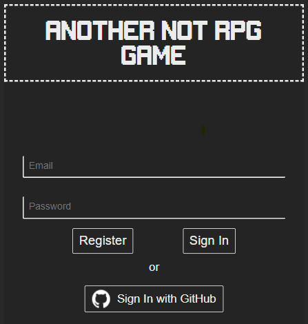
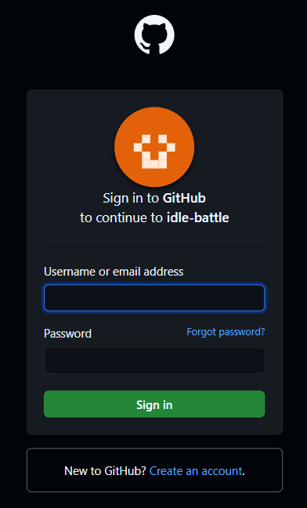
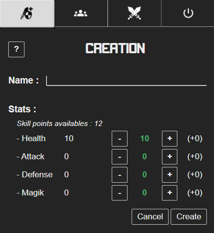
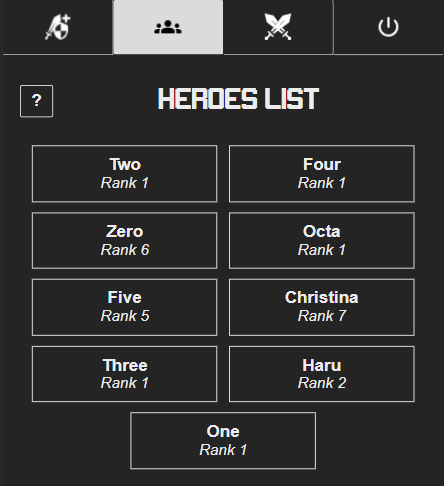
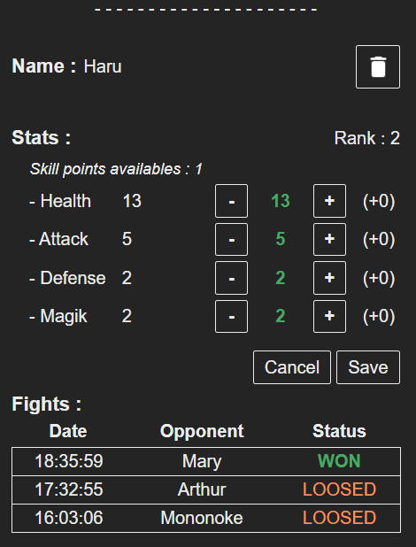
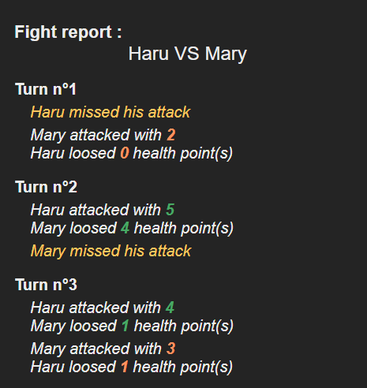
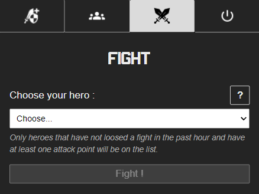

# Another Not Rpg Game : idle-battle


## Table of contents
1. [Purpose](#purpose)  
2. [Changelog](#changelog)  
3. [Technologies choice](#technologies-choice)  
  3.1 [Front](#front)  
  3.2 [Back](#back)  
  3.3 [Data storage](#data-storage)  
  3.4 [Test](#test)  
4. [Installation](#installation)  
  4.1 [Requirements](#requirements)  
  4.2 [Database](#database)  
  4.3 [HTTPS & OAuth](#https-&-oauth)  
5. [Configuration](#configuration)  
6. [Commands](#commands)  
7. [Usage](#usage)  
  7.1 [Login](#login)  
  7.2 [Menu](#menu)  
  7.3 [CREATE](#create)  
  7.4 [POOL](#pool)  
  7.5 [FIGHT](#fight)  

## Purpose

ANRG is an idle battle game prototype develop for a pre-employement test. The purpose is to have a simple character creator and idle game to test the market and the concept.
The app should be reponding to change.

## Changelog

1.0 :  
- Init version of the game

## Technologies choice

- [VueJS - v2.6.12](https://vuejs.org/)
- [NodeJS - v14.16.1](https://nodejs.org/en/)
- [MariaDB - v10.5.9](https://mariadb.org/)

I chose to made a Fullstack Javascript app as it is a powerfull stack, plus it's what I want to be specialized in.
As always I prefer to develop with the less library I can. For me it's better to
- do things by yourself to understand deeply what a library can do for you (how it works)
- don't import heavy library and just use 10% of it
- master your code and version, don't be dependant of external code

### Front

I use VueJS for the front, with no other depencies. I made the responsive css with flex and grid.
It's a responsive SPA build as a SFC.
I use [Parcel](https://fr.parceljs.org/) as web application bundler. It doesn't require any configuration so it's nice for small project and prototype.

### Back

I chose NodeJS for the back with a REST architecture. I use [mariaDb](https://www.npmjs.com/package/mariadb) for db connexion.

### Data storage

I chose to use MariaDb as db because it is an open source and well known db as it was mysql before.
Plus I needed to store related datas. I could have use a JSON storage too, maybe it'll be the case in another version. 

### Standard  

I use [StandardJS](https://standardjs.com/) as a linter.

### Test

To be done

## Installation

This installation is suitable for Linux (so it works on WSL as well)

### Requirements

- Node v14
- MariaDb server
- GitHub account
- idle-battle repo cloned

### Database

1. Start mariaDB
```bash
sudo /etc/init.d/mysql start
```

2. Connect to mariaDB
```bash
sudo mysql
```

3. Create DB - move to the local repo cloned and run the following command 
```bash
sudo mysql < database/initDB.sql
```

### HTTPS & OAuth

First init the repository
```bash
npm install
```

Next generate your SSL certificate
```bash
openssl req -x509 -newkey rsa:4096 -keyout key.pem -out cert.pem -days 365
```

Create an OAuth app on your GitHub (cf: [Create OAuth Apps](https://docs.github.com/en/developers/apps/creating-an-oauth-app)).

## Configuration

Modify the config file [config.json](#server/assets/config.json) according to your needs :

```json
{
  "database": {
    "host": <db hostname>,
    "user": <db username>,
    "password": <user password>,
    "database": "idlebattle",
    "dateStrings": ["DATETIME"]

  },
  "server": {
    "port": <server listening port>,
    "distPath": <path to parcel build folder>,
    "keyPath" : <path to 'key.pem' file>,
    "certPath" : <path to 'cert.pem' file>,
    "OAuthKeysPath": <path to json file which contain OAuth clientId and clientSecret>
  }
}
```

## Commands
- ```npm run dev``` : To start a dev server of the front 
- ```npm run watch``` : To build the front in reactive mode
- ```npm run build``` : To create the executable build version of the front
- ```npm run start:dev``` : To start the nodeJS server only
- ```npm run start:prod``` : To create the executable build version of the front and start nodeJS server

## Usage

After running the application, you can access it by following this address ```https://localhost:<listening port>```

### Login



ANRG require an account to play. You can :
1. Use your email to create an account

After putting an email and a password, click on **Register** to create your account. It'll log you in the app right after.

Next time you'll be able to put your email/password and click on **Sign In** button.

2. Use a gitHub account

You can use a github account. For that, just click on **Sign In with GitHub** button.

It will redirect you to GitHub Authentification, then you can login with your account.




### Menu

The menu let you navigate throw the application. It is always display on screen top. 


You can access : 
1. CREATE: to create a new Hero
2. POOL: to see all your heroes and their stats
3. FIGHT: to enter the battle arena and fight against other hero's player
4. Log Out : to disconnect

### CREATE

If you don't have a hero yet, after login you'll be redirect to CREATE screen. If not, you'll see the POOL screen.



A new hero has 10 health points and 12 skill points available. You can affect the skill points now or later.

The only required action is to choose a name for your Hero. 

Below that you can see from the left to the right: 
- in white, the actual stats of your futur hero
- in green, the new stats you'll affect to him via **-** and **+** buttons
- between parentheses in white, the amount of skill points it will cost 

When you affect some points, it follow the following rules : 
- for Health, increase 1 Health Point costs 1 Skill Point regardless the Health Point amount
- for Attack, Defense and Magick, increase 1 Skill Point costs Skill's amount divided by 5, rounded at superior 

### POOL

On Pool screen, you can see your heroes list.



By clicking on the name of a hero, you'll be able to see his stats.



At this stage, if he has some skill points available, you'll be able to affect them, like in the Create screen.
You can delete it too if you want by clicking on the trash can button.

You'll see the list of his fights. If you on a fight, the details of this one will be displayed bellow.



### FIGHT

On Fight screen you will be able to start a fight with your heroes.



Some rules are important to know : 
1. To fight a hero must have not loosed a fight in the past hour and have at least one attack point.
2. During fight, each hero will attack for a turn. Your hero will always be the first.
3. The first hero who has no more health will loose.

Attack is calculating following this : 
1. Each turn both characters launches a dice with as many faces as the Attack's Skill Point amount, it's the Attack's value  
    _**Example :**_
    - Gaston has 10 Skill Points in Attack
        - he launches a 1D10 dice (a.k.a. a dice with 10 faces : it results a number between 1 and 10)
    - Mathilda has 5 Skill Points in Attack
        - she launches a 1D5 dice (a.k.a. a dice with 5 faces : it results a number between 1 and 5)
2. Attack's value are compared with Defense's Skill Point amount, if the difference is :
    - positive : Attack succeed
    - zero or negative : Attack failed
3. When Attack succeed the difference is substracted from the opponent's Health Point
4. If the difference equals Magik's Skill Point amount, this value is added to the difference  
    _**Exemple :**_
    - Player with Gaston launches the fight : Gaston will always play first
    - Gaston has 10 Skill Points in Attack, he launches 1D10 dice and obtains 10.
    - Gaston has 7 Skill Points in Magik.
    - Mathilda has 3 Skill Points in Defense, difference is 10 - 3 = 7, same value as Gaston's Magik Skill Points
    - Mathilda receives 7 + 7 = 14 damages, if she has 24 Health Skill Points : 24 - 14 = 10 remains
 
After a fight, if your hero:  
  - _**won**_, he will  
      - increase his rank by 1  
      - gains 1 skill  
  - _**loosed**_, he will  
      - decrease his rank by 1
      - will not be able to fight for the next hour